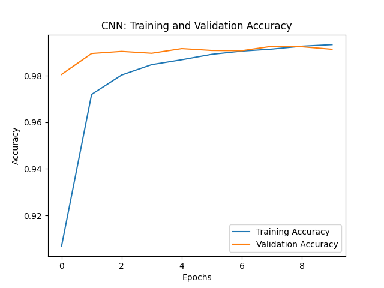
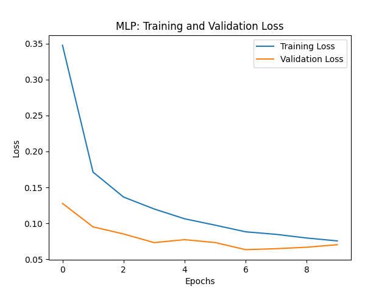
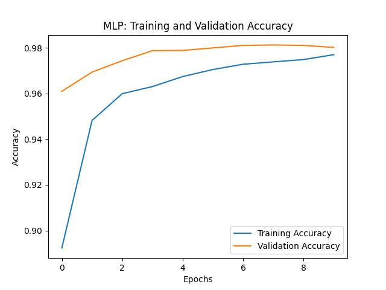

# Handwritten Digit Classification

## 1. Convolutional Neural Network (CNN) Architecture Configuration

### Overview

This section explains the configuration of the Convolutional Neural Network (CNN) architecture designed for handwritten digit classification using the MNIST dataset.

### Architecture Details

#### Convolutional Layers

1. **First Conv2D Layer:**
   - Filters: 32
   - Filter Size: (3, 3)
   - Activation Function: ReLU

2. **Second Conv2D Layer:**
   - Filters: 64
   - Filter Size: (3, 3)
   - Activation Function: ReLU

3. **Third Conv2D Layer:**
   - Filters: 64
   - Filter Size: (3, 3)
   - Activation Function: ReLU

#### Pooling Layers

- MaxPooling2D layers:
  - Applied after the first two convolutional layers.
  - Pool Size: (2, 2)

#### Dense Layers

1. **Dense Layer:**
   - Neurons: 64
   - Activation Function: ReLU

2. **Dropout Layer:**
   - Dropout Ratio: 0.5
   - Purpose: Regularization to prevent overfitting

3. **Output Dense Layer:**
   - Neurons: 10 (for each digit class)
   - Activation Function: Softmax

#### Batch Normalization

- Batch normalization layers are not included in this example but can be added for improved convergence and stability.

#### Optimizer

- Adam Optimizer

#### Learning Rate

- The learning rate is set to the default value for the Adam optimizer.

### Experimental Considerations

- The architecture and hyperparameters mentioned above serve as a starting point.
- It's advisable to experiment with variations in the architecture, learning rate, and regularization techniques for optimal performance.

### Plots

## 2. Multi-Layer Perceptron (MLP) Approach

### Overview

This section discusses the use of a fully connected neural network (Multi-Layer Perceptron or MLP) for handwritten digit classification, comparing it to the CNN approach used in Question 1.

### Advantages

1. **Simplicity:**
   - MLPs are relatively simpler compared to CNNs. They don't have convolutional or pooling layers, making them easier to understand and implement.

2. **Less Computational Resources:**
   - MLPs might require fewer computational resources compared to CNNs, which can be advantageous in scenarios with limited computing power.

### Disadvantages

1. **Lack of Spatial Hierarchies:**
   - MLPs do not consider the spatial hierarchies present in images. They treat each pixel independently, which can result in the loss of important spatial information.

2. **Limited Feature Learning:**
   - CNNs excel in feature learning from images through convolutional and pooling layers. MLPs lack these specialized layers, potentially limiting their ability to learn hierarchical features.

3. **Less Robust to Spatial Transformations:**
   - MLPs are less robust to spatial transformations like translations, rotations, and scaling, which might be crucial for image classification tasks.

4. **Large Number of Parameters:**
   - Fully connected layers in MLPs contribute to a large number of parameters, making them more prone to overfitting, especially when dealing with high-dimensional data like images.

5. **Not Suitable for Complex Structures:**
   - For tasks where the input data has complex spatial structures (like images), CNNs are generally more suitable due to their ability to capture hierarchical features.

In conclusion, while MLPs have simplicity and computational advantages, they might not perform as well as CNNs on image classification tasks, especially when dealing with complex spatial structures. The choice between these approaches depends on the specific requirements of the task and available computational resources.

### Plots

